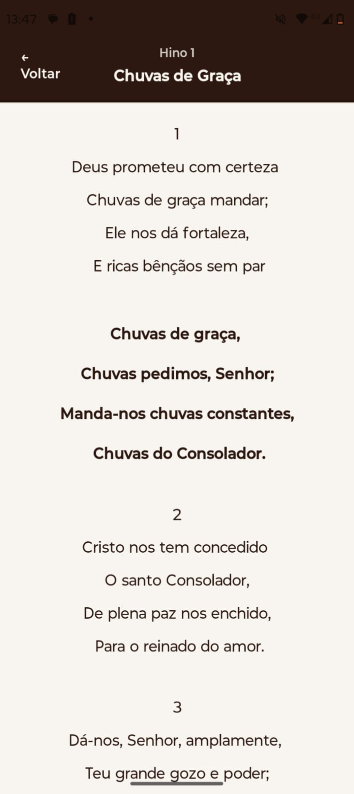
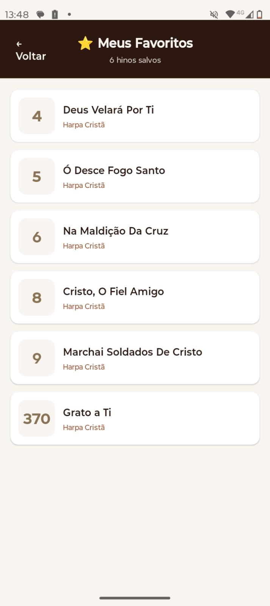

# 📖 Harpa Cristã App - Hinário Digital

[](https://reactnative.dev/)
[](https://expo.dev/)
[](https://reactnative.dev/)
[](LICENSE)

**Harpa Cristã App** é um aplicativo mobile completo que disponibiliza os 640 hinos da Harpa Cristã de forma totalmente offline. Desenvolvido com foco em performance, acessibilidade e uma experiência de leitura acolhedora para momentos de devoção, cultos e estudos bíblicos.

<div align="center">
  
  
  
  
 
</div>

## ✨ Funcionalidades

| Funcionalidade | Detalhe |
|----------------|---------|
| 📚 **640 Hinos** | Biblioteca completa da Harpa Cristã |
| 🔍 **Busca Inteligente** | Pesquise por número (ex: 360) ou título do hino |
| ❤️ **Favoritos** | Salve seus hinos preferidos com um toque |
| 📱 **Totalmente Offline** | Funciona sem internet - todos os dados estão no app |
| 🎨 **Design Acolhedor** | Interface com tons de papel envelhecido para leitura confortável |
| 📖 **Leitura Otimizada** | Fonte serifada e espaçamento ideal para textos longos |

## 🛠️ Tecnologias Utilizadas

### Core
- **React Native 0.81.5** - Framework para desenvolvimento mobile cross-platform
- **Expo SDK 54** - Toolchain para desenvolvimento e build
- **React Navigation 7.x** - Navegação entre telas (Stack Navigator)

### Armazenamento
- **AsyncStorage** - Persistência local offline-first para favoritos e histórico

### UX/UI
- **SafeAreaContext** - Suporte a dispositivos com notch
- **Custom Styling** - Design system próprio com paleta de cores terrosa

### Performance
- **FlatList Otimizada** - Virtualização e lazy loading para 640 itens
- **Debounced Search** - Busca com delay para evitar re-renderizações

## 🏗️ Arquitetura do Projeto

O projeto segue princípios de **Separation of Concerns** com uma estrutura organizada:

```bash
src/
├── screens/ # Camada de apresentação (UI)
│ ├── HomeScreen.js # Lista principal, busca e favoritos
│ ├── HinoDetailScreen.js # Visualização completa do hino
│ └── FavoritosScreen.js # Gerenciamento de favoritos
│
├── services/ # Camada de serviços (lógica de negócio)
│ ├── hinoService.js # Busca e acesso aos hinos
│ └── favoriteService.js # CRUD de favoritos com AsyncStorage
│
├── data/ # Camada de dados
│ └── hinos.json # 640 hinos formatados
│
└── App.js # Configuração de navegação
```

## 🎨 Design System

### Paleta de Cores

| Cor | Código Hex | Uso |
|-----|------------|-----|
| Papel Envelhecido | `#F8F5F0` | Fundo principal |
| Marrom Escuro | `#2C1810` | Headers e títulos |
| Marrom Claro | `#A0522D` | Destaques e subtítulos |
| Número de Hino | `#8B7355` | Identificação do hino |
| Favorito | `#E53935` | Coração ativado |

### Tipografia

- **Títulos**: Sistema Bold (24-28px)
- **Letras dos Hinos**: Georgia / Serif (18px, line-height 30px)
- **Números**: Sistema Bold (22px)

## 🚀 Como Executar

### Pré-requisitos

- Node.js (v18 ou superior)
- npm ou yarn
- Expo CLI
- Emulador Android/iOS ou dispositivo físico com Expo Go

### Passo a Passo

```bash
# 1. Clone o repositório
git clone https://github.com/eduardo7321/harpa-crista-app.git
cd harpa-crista-app

# 2. Instale as dependências
npm install
# ou
yarn install

# 3. Execute com Expo
npx expo start

# 4. Escaneie o QR Code com o Expo Go (Android/iOS)
# Ou pressione 'a' para Android ou 'i' para iOS

```


## 📊 Otimizações de Performance
- Otimização	Implementação
- Virtualização	FlatList com initialNumToRender={20}
- Debounce na busca	Delay de 300ms para redução de chamadas
- Memoização	useCallback em funções de renderização
- Cache offline	AsyncStorage para dados persistentes

## 🤝 Agradecimentos Especiais
- 🙏 "Eu te agradeço, Jesus, meu Senhor
As tuas bênçãos a flux.
Eu me elevo por teu grande amor
Manifestado na cruz!
Ao lado estou das riquezas dos céus
Fluídas de tuas mãos.
Quero cantar mil cantares!
Oferta profunda do meu coração!"

- Agradecemos ao nosso bondoso Deus por tudo que tem feito em nossas vidas. Este projeto é uma pequena contribuição para a comunidade cristã, permitindo que mais pessoas tenham acesso aos hinos que tanto edificam nossa fé.

- *Menção honrosa:* Agradecemos ao DanielLiberato pelo excelente trabalho no projeto [Harpa-Crista-JSON-640-Hinos-Completa](https://github.com/DanielLiberato/Harpa-Crista-JSON-640-Hinos-Completa), que serviu como base para obtermos todos os hinos formatados em JSON. Seu trabalho foi fundamental para a existência deste aplicativo.

## 📈 Implementações futurasRoadmap
- Modo noturno/Dark mode

- Compartilhar versículos como imagem

- Aumentar/diminuir tamanho da fonte

## 📄 Licença

- Distribuído sob licença MIT. Veja o arquivo LICENSE para mais informações.

## 📧 Contato
- Eduardo Silva - [GitHub](https://github.com/eduardo7321)
- [Linkedin](https://www.linkedin.com/in/eduardojose184/)

<div align="center"> <sub>Construído com ❤️ e dedicação para a comunidade cristã</sub> </div>
